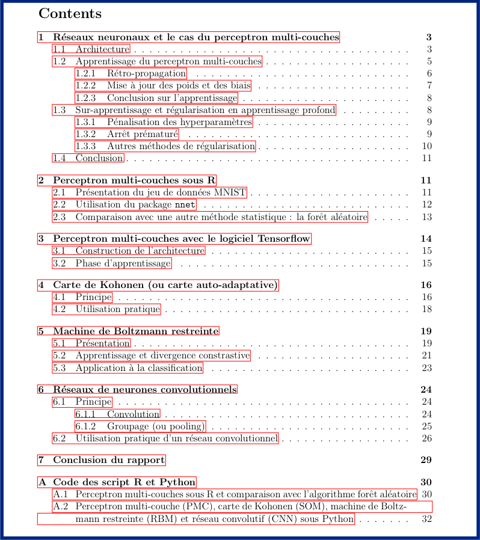

# Neural networks project (part of the M2 course)

This report was written as part of the "Neural Networks" course in the Master 2 Statistical Engineering and Data Science program at Sorbonne University. This course was taught by Prof. Annick Valibouze from January to March 2020.

We present some deep learning methods. We discuss both the theoretical and practical aspects of these algorithms. For the theoretical part, we've tried to be as clear as possible, while remaining mathematically accurate and fairly concise. The practical work is focused towards Computer Vision and was carried out using TensorFlow and Python 3. Note that in one section we use R to present the perceptron. Important code blocks are inserted throughout the report. The complete code, as a notebook, will be found in the appendix.

## Keywords 

Backpropagation, Perceptron, Self-organizing map, Convolutional Nets, Boltzmann machine

## Files

-   MIGNOT_rapport_RN.pdf : the main report (in French)
-   MIGNOT_pres_rapport_RN.pdf : keypoints as a slideshow

## Table of contents

1.  Multi-layer perceptron
    1.  Architecture
    2.  Learning with the MLP
    3.  Over-fitting and regularization for Deep Learning
    4.  Conclusion
2.  Multi-layer perceptron with R
    1.  The MNIST dataset
    2.  The `nnet` R package
    3.  Benchmark against Random Forests
3.  Multi-layer perceptron with Python and Tensorflow
    1.  Architecture
    2.  Learning
4.  Self-organizing maps
    1.  Theory
    2.  In practice
5.  Boltzmann Machines
    1.  Theory
    2.  Learning and the Contrastive Divergence
    3.  Classification with Boltzmann Machines
6.  Convolutional Neural Networks
    1.  Theory
    2.  In practice
7.  Conclusion

Appendix : python and R scripts.

---

En français.

# Projet de réseaux de neurones (dans le cadre du M2)

Ce rapport a été rédigé dans le cadre du cours de "Réseaux de neurones" du Master 2 Ingénierie Statistique et Data Science de l’Institut de Statistique de l’Université de Paris (ISUP), école rattachée au département de sciences de Sorbonne Université (https://www.sorbonne-universite.fr/). Ce cours a été enseigné par Annick Valibouze de janvier à mars 2020.
    
Nous y présentons quelques méthodes d’apprentissage profond. Nous abordons les points de vue théorique de ces algorithmes ainsi que pratique. Pour la partie théorique, nous avons tâché d'être le plus clair possible tout en restant exact mathématiquement et assez concis. La partie pratique s'est effectuée majoritairement avec le logiciel TensorFlow sous Python 3 (une section présente l'utilisation du perceptron sous R) dans le cadre de la reconnaissance d'image (vision artificielle). Les blocs de code importants sont présenté au fur et à mesure du rapport. On trouvera en annexe les codes dans leur entiereté, sous la forme notebook.

## Mots-clés.
Apprentissage profond, Apprentissage supervisé, Apprentissage non-supervisé, Perceptron multi-couches, Méthode de la rétro-propagation, Estimateur universel, Régularisation, Carte de Kohonen (Carte auto-adaptative, Self-organizing maps), Machine de Boltzmann restreinte, Divergence Contrastive, Réseaux convolutionnels, classification, vision artificielle, TensorFlow.

 
